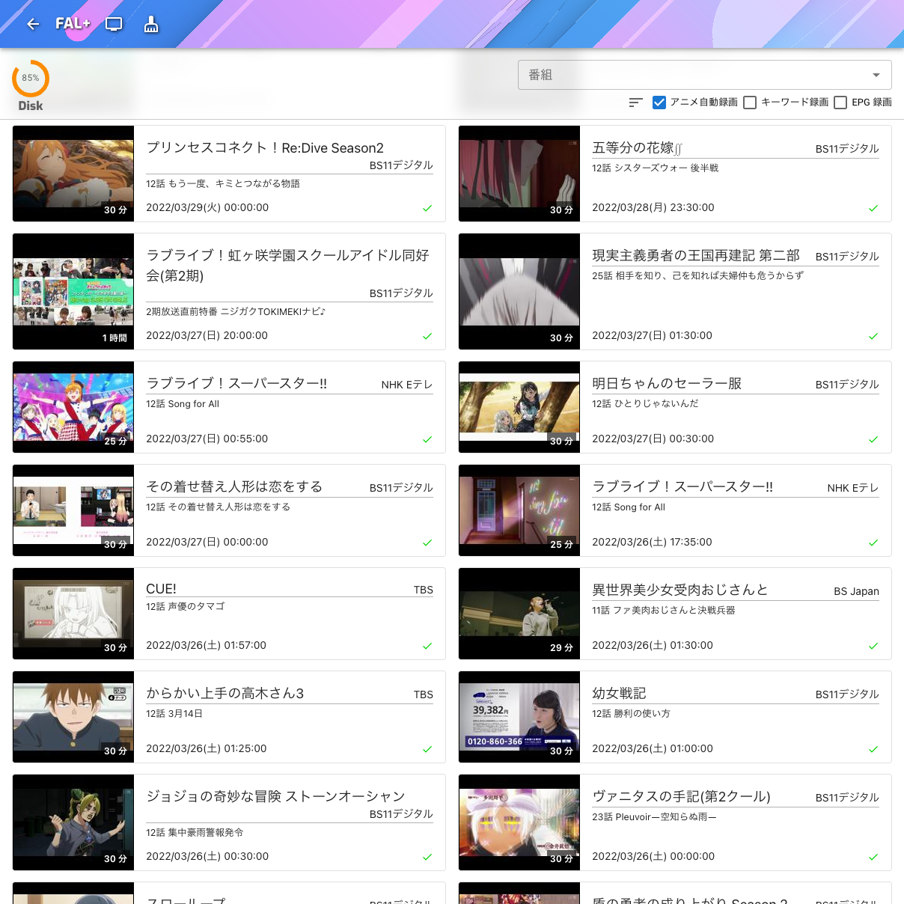
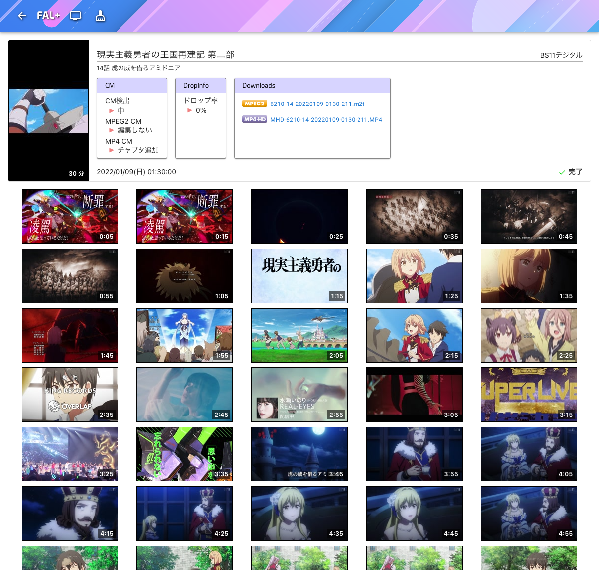
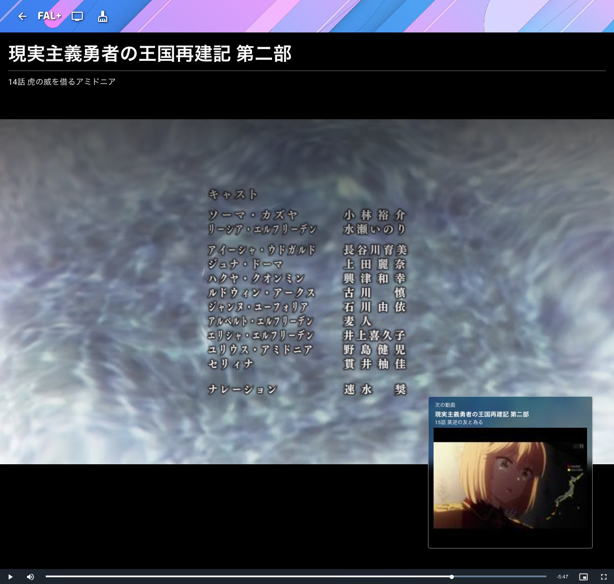
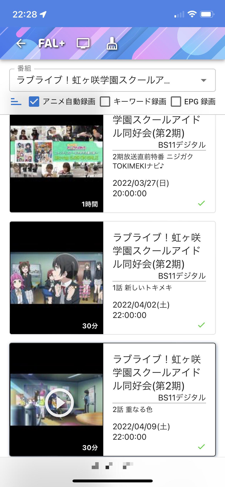
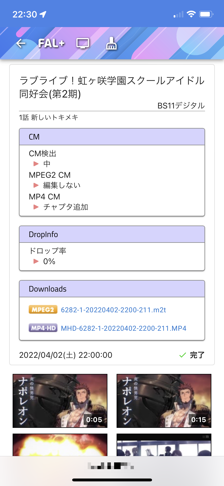
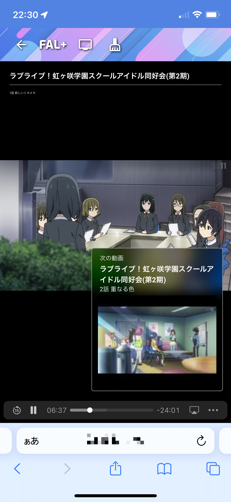

FoltiaUI
----
Foltia ANIME LOCKER 用の拡張 UI

## 提供機能

このパッケージは以下の拡張機能を提供します。

- React / Material UI による令和感ある UI
  - 便利良さそうなフィルタ機能
  - それっぽくなった再生画面
  - 録画一覧の無限スクロール機能
- スマホ・タブレット対応 (以下は確認済)
  - iPhone 12
  - iPad mini
- 連続再生機能
- 画面
  - 録画一覧画面
  - 録画詳細画面
  - 動画プレイヤー画面

## スクリーンショット

### デスクトップ

録画一覧画面


録画一覧画面 (フィルタ)


録画詳細画面


動画プレイヤー画面


### iPhone

録画一覧画面


録画詳細画面


動画プレイヤー画面


## これから提供したい機能

- 動画お掃除機能
- 動画アップロード機能

## インストール方法

### インストール

Foltia AnimeLocker に foltia ユーザーでログインした後、以下のコマンドを実行して下さい。
```bash
$ curl -L -o /tmp/fui.tar.gz "$(curl -sS -H 'Accept: application/vnd.github.v3+json' 'https://api.github.com/repos/piclane/FoltiaUI/releases/latest' | grep '"browser_download_url"' | sed -E -e 's/^.*"(https:[^"]+)"$/\1/')"
$ cd /tmp
$ tar zxf fui.tar.gz
$ rm fui.tar.gz
$ cd foltia_ui-<version>
$ su -c "$(pwd)/install.sh" -
```

### アンインストール

Foltia AnimeLocker に foltia ユーザーでログインした後、以下のコマンドを実行して下さい。
```bash
$ cd /tmp/foltia_ui-<version>
$ su -c "$(pwd)/uninstall.sh" -
```
